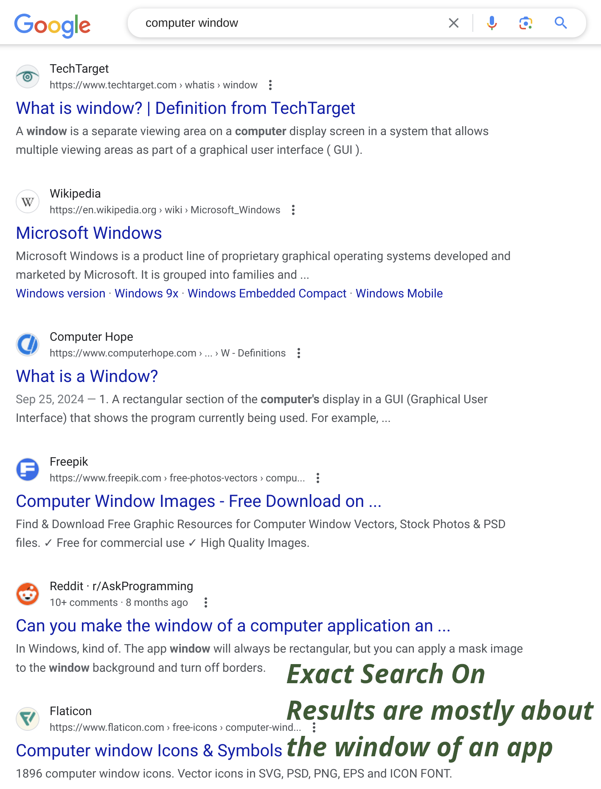

A browser extension that toggles exact/verbatim search in search engines.

Major search engines, such as Google, are smart in guessing what you are searching for. They do so
with many tricks, including using word stems and synonyms, skipping part of the search, etc. This
browser extension allows you to toggle between:

- allowing the search engine to guess, and
- requiring the search engine to search for the exact terms you give.

To use Exact Search, search in your favorite search engine as usual, then click on the extension or
press <kbd>Alt+Shift+E</kbd> (Chrome) or a custom keyboard shortcut (Firefox) to toggle exact
search!

## Screenshots

|  Exact Search Off   |  Exact Search On   |
| :-----------------: | :----------------: |
|  |  |

## Supported Search Engines

- Bing
- DuckDuckGo
- Ecosia
- Google
- Yahoo
- Yandex

_Exact Search is an open source project. If you are interested, feel free to check out the [source
code](https://github.com/8hobbies/exact-search)._
